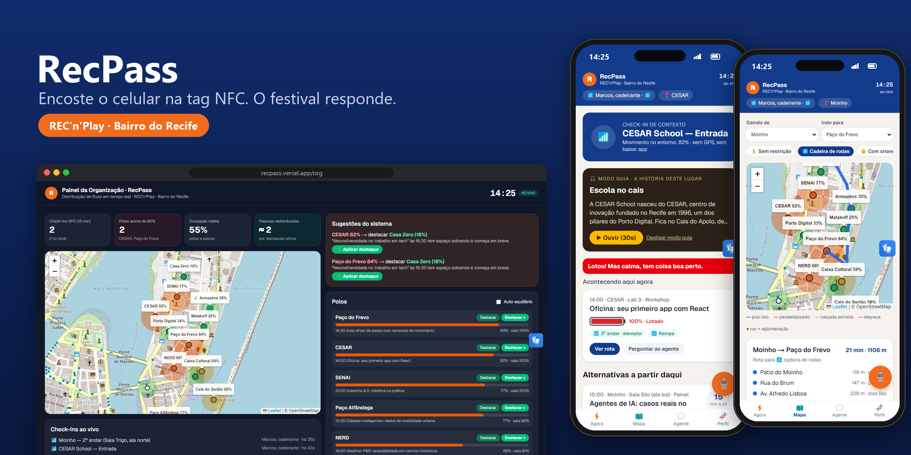
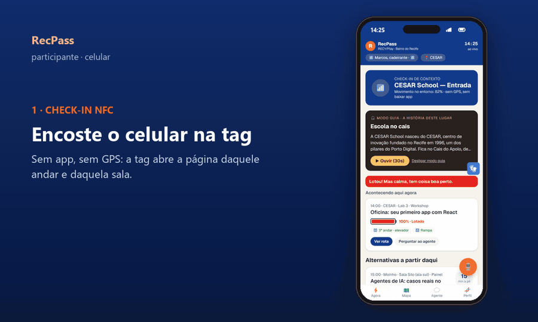
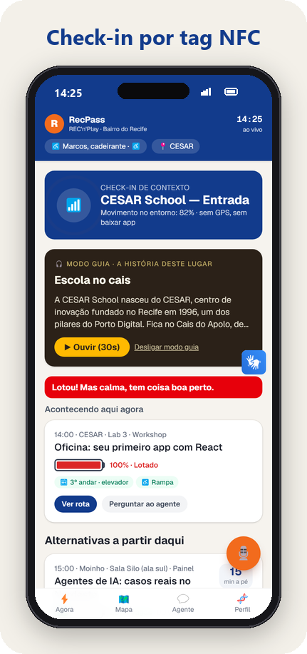
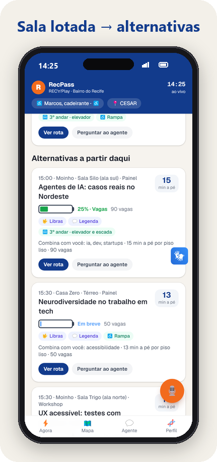
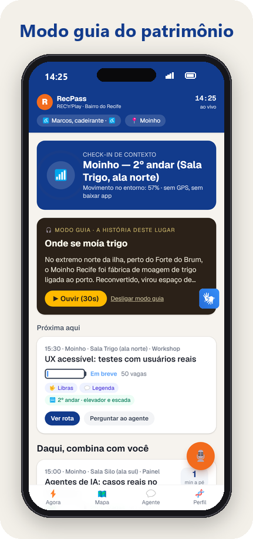
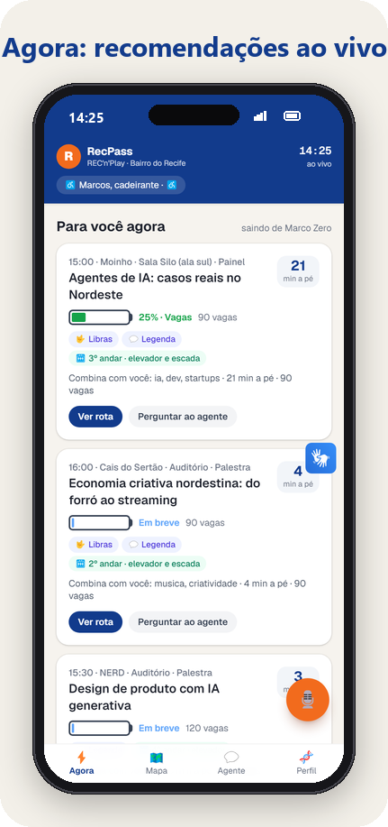
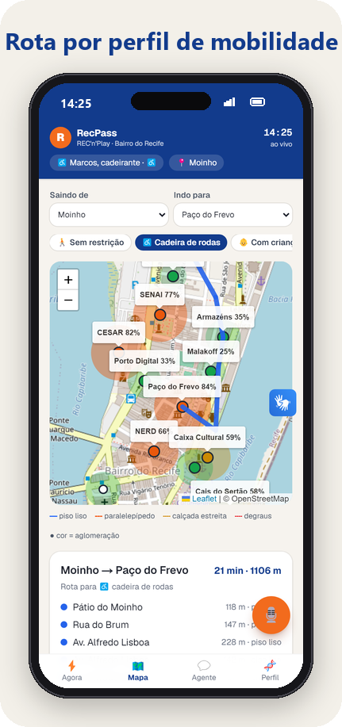
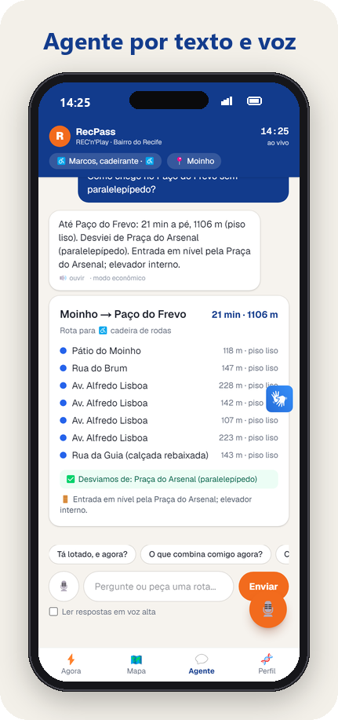
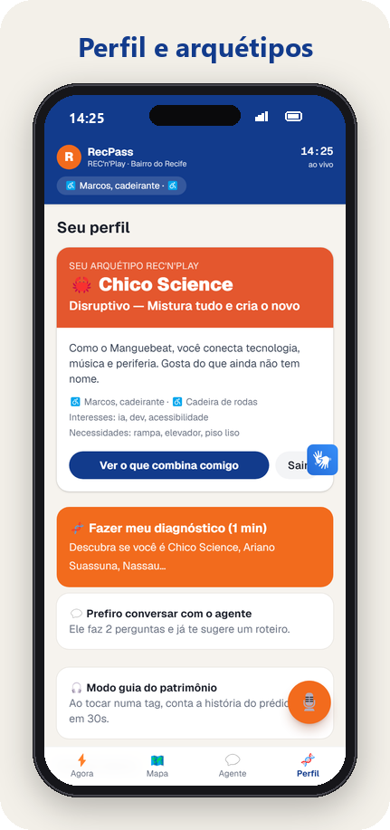
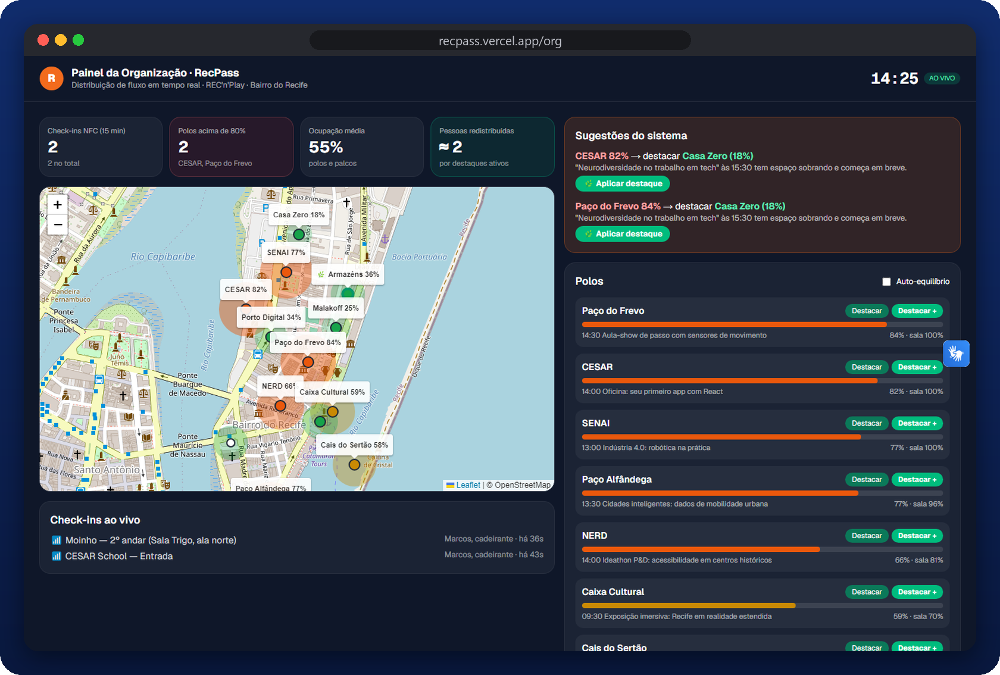

# RecPass — POC Ideathon P&D / REC'n'Play

Check-in de contexto por **tag NFC** + agente de mobilidade e acessibilidade para o Bairro do Recife.



📚 Documentação completa (pesquisa, arquitetura, tags, painel, custos, pitch e roadmap) em [`docs/`](docs/README.md).

## Demo

<p align="center">
  
</p>

## Principais funcionalidades

O app do participante foi feito para o **celular**; o painel da organização, para o **desktop**.

| | | |
|:---:|:---:|:---:|
|  |  |  |
| **Check-in por tag NFC**<br>Encostou o celular, abriu a página daquele andar e daquela sala. Sem app e sem GPS. | **Sala lotada → alternativas**<br>Se lotou, mostra atividades parecidas que ainda dão tempo de alcançar. | **Modo guia do patrimônio**<br>A história do prédio em 30 s, em áudio, na própria tag. |
|  |  |  |
| **Agora**<br>Recomendações para o seu perfil, com a lotação em forma de "bateria". | **Rota por perfil de mobilidade**<br>Cadeira de rodas, criança de colo, baixa visão: evita paralelepípedo e degraus. | **Agente por texto e voz**<br>Responde com rota, lotação e alternativas usando as mesmas ferramentas do app. |
|  | | |
| **Perfil e arquétipos**<br>Diagnóstico de 1 min (Chico Science, Ariano, Nassau…) ou contas demo. | | |

### Painel da organização (desktop)



Mapa de calor dos polos, check-ins NFC ao vivo, sugestões do sistema e o botão **Destacar**, que leva público de um polo cheio para um vazio.

> As imagens foram geradas a partir do app rodando localmente, com a conta demo "Marcos, cadeirante" e o relógio da simulação em 14:25.

## Rodar

```bash
npm install
cp .env.example .env.local   # opcional: OPENAI_API_KEY (ou GEMINI_API_KEY) e SUPABASE_* (sem elas: modo regras + estado em memória)
npm run dev                   # http://localhost:3000
```

## Telas

| Rota | O quê |
|---|---|
| `/` | Agora: recomendações e programação ao vivo com a lotação em forma de "bateria" |
| `/t/<id>` | O que abre ao encostar o celular na tag: você está aqui, guia do patrimônio, sala lotada → alternativas, agente |
| `/mapa` | Mapa de calor + rota por perfil de mobilidade (piso liso × paralelepípedo × degraus) |
| `/agente` | Chat (texto e voz). O botão 🎙️ flutuante abre a "chamada" com cota de 3 min a cada 2 h |
| `/perfil` | 7 contas demo + autodiagnóstico (Chico Science, Ariano, Nassau, Paulo Freire, Naná, Clarice) |
| `/org` | Painel da organização: mapa de calor, destaque de polos vazios, auto-equilíbrio, check-ins ao vivo, relógio da simulação |
| `/tags` | Gravar e ler as tags pelo Chrome Android (Web NFC) ou copiar a URL para o app NFC Tools |

## Arquitetura de custo

- **Sem IA (custo zero, roda no aparelho):** rotas (Dijkstra com peso de piso, degraus e multidão por perfil), lotação, recomendações e a distribuição de fluxo — tudo em `src/lib/engine.ts`.
- **Roteador econômico:** perguntas com intenção clara (rota, banheiro, embarque) são respondidas por `agent-fallback.ts` sem chamar a IA.
- **IA só para conversa aberta:** OpenAI `gpt-4.1-mini` (ou Gemini Flash-Lite, conforme a chave configurada), que conversa e chama as ferramentas determinísticas. Sem internet, cai para as regras.

## Supabase

```bash
supabase link --project-ref <ref-do-recpass>
supabase db push
```

## Tags

NTAG213: cada tag guarda só `https://<domínio>/t/<id>`. O significado de cada id fica em `TAGS` (`src/lib/data.ts`).

## Limitações da POC

- A programação, a lotação e as coordenadas são simuladas ou aproximadas.
- O estado compartilhado usa o Supabase quando `SUPABASE_URL` e `SUPABASE_SERVICE_ROLE_KEY` estão definidos (migração em `supabase/migrations`). Sem elas, fica em memória. A atualização é por polling a cada 3 s; o próximo passo é o Realtime.
- A cota de voz é controlada no navegador. Em produção precisa ser no servidor, por usuário.
