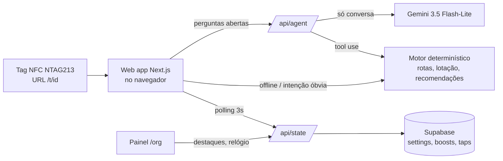

# 02 — Solução e arquitetura

## Conceito: check-in de contexto

A pessoa encosta o celular numa tag NFC (num poste, numa lixeira, num totem ou na porta) e o navegador abre `/t/<id>`, **sem instalar app e sem depender do GPS**, que costuma falhar entre os casarões. A página já sabe exatamente onde a pessoa está e mostra:

- **Você está aqui:** o movimento no entorno e a atividade da sala, com a lotação em forma de "bateria".
- **Lotou?** Alternativas que combinam com o perfil e dão tempo de chegar a partir dali.
- **Escadaria tombada?** Onde fica o acesso universal (rampa ou elevador).
- **Ponto de embarque:** qual dos pontos está mais vazio no momento.
- **Guia do patrimônio:** a história do prédio narrada em 30 segundos, opcional.
- **O agente**, por texto ou por voz.

## Telas

| Rota | Função |
|---|---|
| `/` | Recomendações e programação ao vivo, com filtros "só com vagas" e "acessível pra mim" |
| `/t/[id]` | A tela que a tag abre |
| `/mapa` | Mapa de calor e rota por perfil de mobilidade |
| `/agente` | Chat. O botão 🎙️ flutuante abre a chamada de voz, com cota |
| `/perfil` | Contas demo, autodiagnóstico e liga/desliga do modo guia |
| `/org` | Painel da organização |
| `/tags` | Gravação e leitura das tags |

## Arquitetura

### Motor sem IA (`src/lib/engine.ts`)

- **Rotas:** Dijkstra sobre um grafo de ruas, em que cada trecho tem um tipo de piso (asfalto, paralelepípedo, calçada estreita, degraus). O custo multiplica a distância por um fator de piso e de multidão que depende do perfil:
  - cadeirante: paralelepípedo pesa ×3,5 e degrau é proibido;
  - sensorial: multidão pesa ×2,5.
- **Rota comum × rota adaptada:** a rota adaptada mostra o que foi evitado, por exemplo "Desviamos de: Rua da Moeda (paralelepípedo)".
- **Lotação (simulada):** cada atividade enche numa curva determinada pela popularidade e pelo horário, com um pouco de ruído. O painel interfere aos poucos.
- **Recomendações:** a pontuação soma relevância (55%), vagas (15%), proximidade (15%) e urgência (15%), mais os bônus de acessibilidade. Ficam de fora as atividades lotadas, sem acesso para o perfil ou que não dá tempo de alcançar.

### Agente (`src/app/api/agent`)

1. **Roteador econômico:** se a intenção é óbvia (rota até um local, banheiro ou fraldário, ir embora), quem responde é `agent-fallback.ts`, sem IA.
2. **Senão:** o Gemini 3.5 Flash-Lite (configurável por `GEMINI_MODEL`), com chamada de função e 4 ferramentas (`recomendar_atividades`, `buscar_atividades`, `calcular_rota`, `status_local`). **A IA nunca inventa vagas nem rotas: ela consulta o motor.**
3. **Sem internet ou sem chave:** as regras rodam no próprio navegador.

### Voz e acessibilidade

- Reconhecimento e síntese de voz do próprio navegador (Web Speech API), em pt-BR e a custo zero.
- Chamada contínua (ouvir → responder → ouvir) com cota de **3 min a cada 2 h**.
- **VLibras**, o widget oficial do governo, para tradução em Libras.
- Selos nas atividades: Libras, audiodescrição, legenda, andar com ou sem elevador, rampa, acesso lateral, prédio sem acessibilidade.

## Dados

- `src/lib/data.ts`: locais, ruas, programação mock, contas demo, arquétipos e tags.
- `src/lib/heritage.ts`: as histórias dos prédios. São conteúdo de demonstração e precisam passar pela curadoria.
- Supabase: `festival_settings`, `venue_boosts` e `tag_taps`. O RLS está ligado e só o servidor acessa as tabelas. A migração fica em `supabase/migrations`.

## Autodiagnóstico: arquétipos

| Figura | Arquétipo | Temas |
|---|---|---|
| 🦀 Chico Science | Disruptivo | IA, startups, games, hardware, música |
| 📜 Ariano Suassuna | Guardião das Raízes (o "conservador") | cultura, patrimônio, educação |
| 🌉 Maurício de Nassau | Visionário Urbano | cidades, negócios, investimento, dados |
| 📚 Paulo Freire | Curioso Aprendiz | educação, carreira, iniciante, comunidade |
| 🥁 Naná Vasconcelos | Experimental | arte, som, XR, design |
| 🪞 Clarice Lispector | Introspectiva | UX, escrita, diversidade, ambientes calmos |
